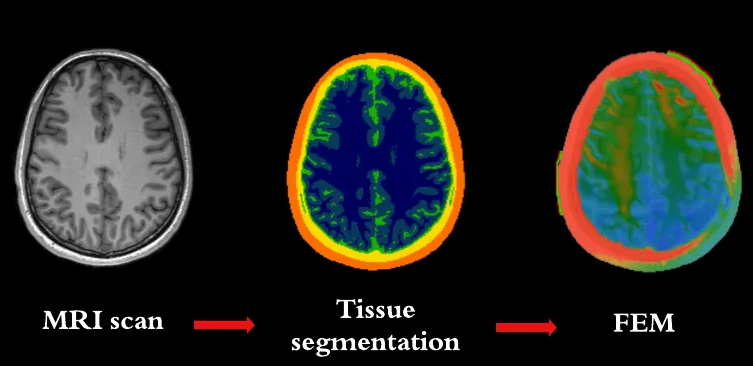

# tDCS-induced Electric Field Models from MRI anatomical scans
Material for the workshop tDCS-induced Electric Field Models from MRI - University of Innsbruck, Neuroscience Workshop (Series 2025).

## Introduction

In the field of *Transcranial Electric Stimulation* (tES), accurately simulating how tES-induced current spreads in the brain, which regions it reaches, and to what extent, is fundamental to understanding inter-individual differences in response to the stimulation. In fact, differences in skull shape, cortical folding, cerebrospinal fluid, or other neuroanatomical features greatly influence electric fields induced by tES in the brain.

Models of tES electric fields in the brain can help explain the great variability observed in studies involving tES (that is, the degree to which participants / patients respond to the stimulation varies a lot). Similarly, those models can also help optimise tES electrode montage to the specific neuroanatomical features of an individual.

In summary, current-flow models are generated using MRI anatomical scans of human heads (such as T1 and T2 scans), which undergo several processing steps:

1. The MRI scan is segmented into different tissues (i.e., each voxel in the scan is assigned to either grey matter, white matter, cerebrospinal fluid, bone, skin, etc.).
2. Different tissue conductivities are assigned to each tissue type.
3. Virtual electrodes are placed on the scalp based on pre-specified locations.
4. Everything is then converted into a 3D mesh.
5. The current flow is estimated through a finite element model (FEM) solved numerically.  

<div style="text-align: center;">
  
</div>
  

In this hands-on workshop, we will go through the entire process highlighted above and we will also learn how to visualise the computed tES models, as well as how to calculate region-of-interest (ROI) metrics using an Atlas. We will use ROAST (_Realistic Volumetric-Approach-Based Simulator For TES_)<sup>[1](#references)</sup> for the simulation, SPM (MATLAB) for the normalisation of the results, and Python for the data visualisation and ROI metrics calculation.

## Software requirement and installation
The workshop will require the following software:
- [Matlab](https://www.mathworks.com/help/install/ug/install-products-with-internet-connection.html)
- [ROAST](https://www.parralab.org/roast/): An open source tool that runs on Matlab, used to compute electric fields from MRI structural images.  
- [MRIcroGL](https://www.nitrc.org/projects/mricrogl): MRIcroGL allows you to view 2D slices and renderings of your brain imaging data. We will use it to find the coordinates for the virtual electrodes
- [Miniconda](https://docs.anaconda.com/miniconda/): A lighter installation of Anaconda Distribution that includes only conda and Python. This will be used to create the environment with the libraries used to access and visualise the results from ROAST.
- [Git](https://git-scm.com/downloads)
- [VScode \(suggested\)](https://code.visualstudio.com/download)


```Note that most of the commands to build the environments and install the dependencies can be run from the terminal within VS code. If you use a different editor you can run the commands from your preferred terminal directly.```

### Repository
[Install git](https://github.com/git-guides/install-git) if needed, and clone the current repository:

```bash
git clone https://github.com/davide-aloi/neuroscience-workshop-Innsbruck-2025
cd neuroscience-workshop-Innsbruck-2025
```

### Python envioronment
1) Download and install Miniconda
2) From VScode, open a new terminal and build the environment with the required libraries:

```bash
conda env create -f assets/environment.yml
# Verify that the environment was correctly created
conda env list
```

This should output: 
```console
# conda environments:
base                     C:\Users\User\miniconda3
tdcs_env                 C:\Users\User\miniconda3\envs\tdcs_env
```

To activate a environment:
```bash
conda activate tdcs_env
```

### ROAST 

1) Download Roast from its [homepage](https://www.parralab.org/roast/) or clone the repository by running: 
```bash
# Clone ROAST into the roast folder of this repository
mkdir roast
git clone https://github.com/andypotatohy/roast roast
```

2) From Matlab, navigate to the current repository folder, and either right-click on the roast folder -> add to path or run the following command in the Matlab console:
```matlab
addpath('roast')  
```

### Download test data and unzip it
- [T1 scan](https://packages.bic.mni.mcgill.ca/mni-models/icbm152/mni_icbm152_nl_VI_nifti.zip)

Place the file within the mri_data folder of the current repository. 

> [!NOTE]  
>You can use your MRI scans if you have them, but for the sake of this workshop we will use the ICBM152 template. Moreover, the ROAST pipeline allows to use T2 scans as well, but for the sake of simplicity we will only use T1 scans. However, if you have T2 scans, you can use them as well to improve the accuracy of the SPM segmentation.


# Step-by-Step Instructions
For simplicity, the workflow is divided into sub-pages, each focusing on a specific step of the process:
1. [Using ROAST: an overview](docs/roast.md).
2. [Running the simulation with ROAST: practical examples](docs/roast_simulation.md).
3. [ROAST putput files](docs/roast_output.md).
4. [Normalisation with SPM](docs/normalise_roast_results.md). 
5. Visualising results and gathering ROI-specific metrics.


# FAQs
- [Git command not found (windows) &rarr; add git to system paths](https://linuxhint.com/add-git-to-path-windows/)
- [Conda command not found (windows) &rarr; add conda to system paths](https://saturncloud.io/blog/solving-the-conda-command-not-recognized-issue-on-windows-10/)

# Useful resources
- [ROAST homepage](https://www.opensourceimaging.org/project/roast/#:~:text=ROAST%3A%20A%20fully%20automated%2C%20Realistic,such%20as%20iso2mesh%20and%20getDP.)
- [Nilearn introduction](https://nilearn.github.io/stable/introduction.html)
- [MRIcroGL manual](https://www.cgl.ucsf.edu/home/meng/dicom/mricrogl-manual.pdf)
- [AAL3 Atlas](https://www.oxcns.org/aal3.html)


# References
1) Huang Y, Datta A, Bikson M, Parra LC. ROAST: An Open-Source, Fully-Automated, Realistic Volumetric-Approach-Based Simulator For TES. Annu Int Conf IEEE Eng Med Biol Soc. 2018 Jul;2018:3072-3075. doi: 10.1109/EMBC.2018.8513086. PMID: 30441043.
2) ...
