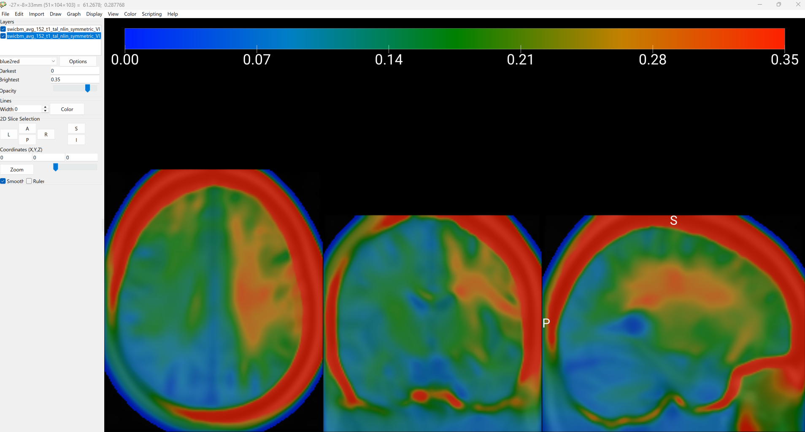

# Visualising ROAST results in MRIcroGL

To visualise the results of your ROAST simulations on MRIcroGL, you can follow these steps:

- Open MRIcroGL and load the T1-weighted image (e.g., `sw{name_of_your_scan}.nii`). If you have used as T1 icbm_avg_152_t1_tal_nlin_symmetric_VI.nii, this will be `swicbm_avg_152_t1_tal_nlin_symmetric_VI.nii`.
- File -> Add Overlay -> Select the ROAST output file you want to visualise (e.g., `sw*emag*.nii`, `sw*e*.nii`)
- Adjust the overlay opacity setting of the smoothed and normalised nifti image to your liking (click on the layer of the scan, and adjust the opacity).
- Lower down the opacity of the electric field nifti image to make the T1-weighted image more visible.
- Switch to the layer of the electric field magnigude / vector and select blue2red as colour map.
- Change the Darkest setting to 0 and the Brightest to 0.35 (or adjust it to your liking). This will make the electric field more visible.

The output should look similar to the image below:

# Visualising ROAST results in Python and applying ROIs
