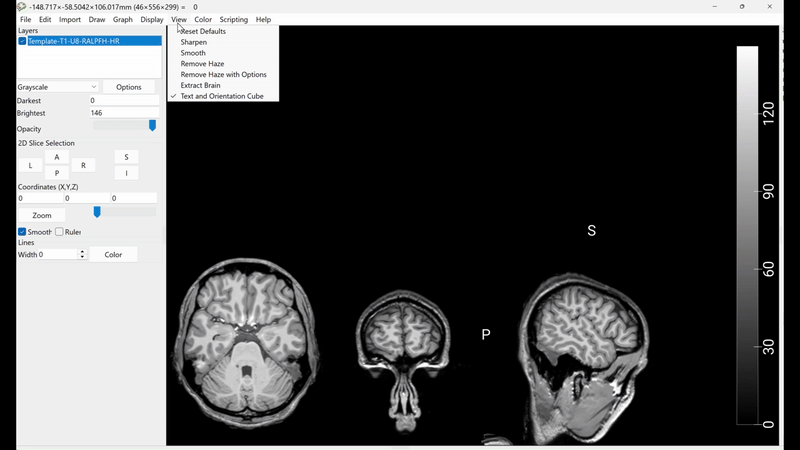

# Using ROAST: how to place virtual electrodes and run simulations for tDCS-induced electric fields

In studies investigating transcranial direct current stimulation (tDCS) (both in healthy and clinical populations) a significant source of variability in observed outcomes arises from the heterogeneity of brain anatomical features or  abnormalities. In fact, inter-individual differences in brain lesions, cortical atrophy, and skull geometry substantially affect how electric current flows through the brain. This variability undermines the reproducibility and precision of manual electrode placement approaches, often leading to reduced current intensity at the intended target and unpredictable current spread or direction (Nasimova & Huang, 2022).

One approach to address the challenges posed by inter-individual anatomical variability is the utilisation of individualised finite element models (FEM) derived from MRI scans, which allow the simulation of tDCS-induced electric field distributions across different tissues and regions of the brain (Albizu et al., 2020; Nasimova & Huang, 2022). These models have become increasingly accessible thanks to advancements in automated tissue segmentation and the emergence of open-source software packages that streamliene the modelling pipelines, such as SimNIBS (Windhoff et al., 2013) and ROAST (Huang et al., 2018, 2019).

## ROAST
In this workshop, we will focus on ROAST (Realistic vOlumetric Approach-based Simulator for TES), a fully automated MATLAB-based pipeline designed to model current flow induced by tES. ROAST allows to compute electric field distributions (magnitude and direction) starting from a T1-weighted (and optionally T2-weighted) anatomical MRI, requiring only minimal manual intervention.

A few notes about ROAST: 

- ROAST is a one-command pipeline that automates most processing steps, including tissue segmentation, electrode placement, meshing, and FEM solving.
- ROAST electrode placement can be achieved both specifying 10-20 electrode positions or from actual MRI coordinates (i.e., identifyied manually using MRIcrongl).
- The ROAST package is built on top of existing tools like SPM12 (Matlab), Iso2Mesh, and getDP.
- ROAST handles all steps in a unified workflow.

The ROAST pipeline consists of several key steps, each of which plays a crucial role in generating accurate and realistic electric field models. I will first go through a theoretical overview of the pipeline, and then we will run some simulations on sample data.

### Step-by-step breakdown of the ROAST pipeline
ROAST starts from a T1-weighted anatomical MRI in NIfTI format. Optionally, a T2-weighted scan can also be provided to improve segmentation quality and mesh definition.

> [!NOTE]
> Why is segmentation needed?
> Segmentation is a critical step because different tissues in the head have different electrical conductivities. For example, CSF conducts current much more easily than skull or white matter. By assigning each voxel in the MRI to a specific tissue class, ROAST can later assign appropriate conductivity values and generate a realistic head model. This is essential for accurately simulating how current flows during tDCS.

#### 1. Tissue segmentation
Using SPM12, ROAST automatically segments the head into the following tissue types:

- white matter (WM),
- grey matter (GM),
- skull,
- scalp,
- CSF,
- air cavities. 

During segmentation, each voxel in the MRI is labeled with a corresponding tissue class. The result is a 3D labeled volume which will be used by ROAST to define conductivity boundaries in the simulation.

> [!NOTE]  
>The quality of segmentation strongly affects the final model. Including a T2 scan is especially helpful when the T1 image alone does not offer sufficient contrast between CSF and surrounding tissues.

> [!NOTE]  
>For participants with abnormal anatomies such as large lesions or tumors, standard SPM segmentation may not perform adequately. In such cases, ROAST offers the option to use MultiPriors, a pre-trained deep convolutional neural network designed to handle atypical head anatomies. To enable this, set the multipriors flag to 'on'. Note that MultiPriors requires only a T1-weighted scan and should not be used with a T2 image. For an example, refer to Example 17 in the official ROAST documentation.

##### 1.1. Post processing
After segmentation, ROAST applies a custom post-processing step to refine the tissue maps produced by SPM. This includes smoothing the segmentations, filling CSF gaps, and removing disconnected voxels (Huang et al., 2019). The result is a clean, discrete tissue map in which each voxel is uniquely assigned to one tissue type specified above.

#### 2. Conductivity values assignment
Once the tissues have been segmented, ROAST assigns a set of default isotropic conductivity values to each tissue type and to the electrode components. These conductivity values determine how easily electrical current can pass through each material, which is critical for realistic current flow modelling. The default values used by ROAST are (Huang et al., 2019):

- Grey matter: 0.276 S/m
- White matter: 0.126 S/m
- Cerebrospinal fluid (CSF): 1.65 S/m
- Bone: 0.01 S/m
- Skin: 0.465 S/m
- Air: 2.5 × 10⁻¹⁴ S/m
- Electrodes: 5.9 × 10⁷ S/m
- Conductive paste: 0.3 S/m

These values are assumed to be isotropic (the same in all directions) and constant across the entire model unless manually adjusted.

#### 4. Electrode placement
Next, ROAST places virtual electrodes on the scalp using one of two methods:

- Method 1: Electrode placement via standard EEG systems (e.g., 10–20 or BioSemi-256);
- Method 2: Electrode placement via custom-defined coordinates in subject-specific MRI space.

For greater anatomical precision, especially in individualised modelling, you may choose to specify custom electrode coordinates per participant.

For completeness, I will go through both approaches.

##### 4.1 Electrode placement via standard EEG montages
ROAST can automatically place electrodes on the scalp using standard EEG montages. This is particularly useful for those who want to quickly set up a simulation without needing to manually specify electrode coordinates. The user can select from a list of standard montages, such as the 10-20 system or the BioSemi-256 system. ROAST will then automatically convert these locations to the subject-specific MRI space using the transformation matrix generated during the normalisation step. 

The list of available montages and electrode locations can be found in the [ROAST documentation](https://github.com/andypotatohy/roast/blob/master/capInfo.xlsx). 

##### 4.2 Manual electrode placement
Alternatively, you can manually specify the coordinates of the electrodes in the subject's MRI space. This is useful for custom montages or when using non-standard electrode placements. To do this, you will need to identify the coordinates of the desired electrode locations in the MRI space and provide them to ROAST in a specific format.

To accurately identify the coordinates we can use the visualisation tool called MRIcroGL. This tool allows you to view the MRI scan in with a three-dimensional render, along with the canonical multi-planar view, and to select any voxel in the 3D space and display the respective MRI volume space coordinates.

Below it's shown how to do this:

The MRI space coordinates will appear on top, next to the 3D space coordinates.

The coordinates are in the format: (x, y, z), where x, y, and z are the voxel indices in the MRI space. You can then copy these coordinates into a text file or spreadsheet for later use in ROAST.

#### 4.3. Electrode specifications

In addition to specifying electrode positions, ROAST allows users to define the shape and size of each electrode individually. Three electrode types are supported: 'disc' (default), 'pad', and 'ring'. Each type has its own required dimensions. For example, disc electrodes are defined by [radius, height] (default: 6 mm × 2 mm), pad electrodes by [length, width, height] (default: 50 mm × 30 mm × 3 mm), and ring electrodes by [inner radius, outer radius, height] (default: 4 mm × 6 mm × 2 mm). This flexibility enables the simulation of mixed electrode montages, where different shapes and sizes are used simultaneously, enhancing the model’s anatomical and functional realism.

Other parameters that one can specify are present in the official documentation.

### Summary
The above provides an overview of how ROAST models tDCS-induced electric fields by using individualised MRI-based head models and flexible electrode configurations. I covered the key steps in the ROAST pipeline, including tissue segmentation, conductivity assignment, and electrode placement using both standard and custom approaches.

# References
1) Albizu, A., Fang, R., Indahlastari, A., O’Shea, A., Stolte, S. E., See, K. B., Boutzoukas, E. M., Kraft, J. N., Nissim, N. R., & Woods, A. J. (2020). Machine learning and individual variability in electric field characteristics predict tDCS treatment response. Brain Stimulation, 13(6), 1753–1764. https://doi.org/10.1016/j.brs.2020.10.001
2) Nasimova, M., & Huang, Y. (2022). Applications of open-source software ROAST in clinical studies: A review. Brain Stimulation, 15(4), 1002–1010. https://doi.org/10.1016/j.brs.2022.07.003.
3) Windhoff, M., Opitz, A., & Thielscher, A. (2013). Electric field calculations in brain stimulation based on finite elements: An optimized processing pipeline for the generation and usage of accurate individual head models. Human Brain Mapping, 34(4), 923–935. https://doi.org/10.1002/hbm.21479
4) Huang, Y., Datta, A., Bikson, M., & Parra, L. C. (2019). Realistic volumetric-approach to simulate transcranial electric stimulation—ROAST—a fully automated open-source pipeline. Journal of Neural Engineering, 16(5), 056006. https://doi.org/10.1088/1741-2552/ab208d.
5) Huang, Y., Datta, A., Bikson, M., & Parra, L. C. (2018). ROAST: An Open-Source, Fully-Automated, Realistic Volumetric-Approach-Based Simulator For TES. 2018 40th Annual International Conference of the IEEE Engineering in Medicine and Biology Society (EMBC), 3072–3075. https://doi.org/10.1109/EMBC.2018.8513086.